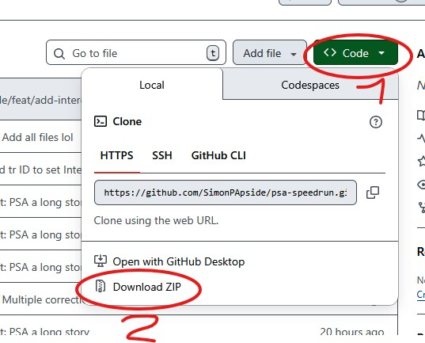
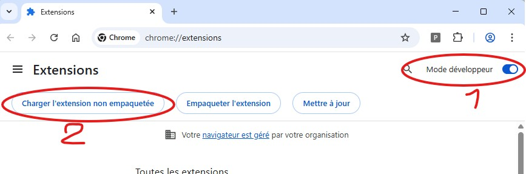

# Configuration Interface

This extension provides a unified interface to fill PSA timesheets efficiently.

## Installation & Activation (Chrome) [FR]

Pour activer cette extension dans Google Chrome, suivez les étapes suivantes :

1. **Télécharger le code** : Récupérez les fichiers du projet (par exemple via "Download ZIP").
   
2. **Ouvrir les Extensions** : Dans Chrome, allez dans le menu, puis **Extensions** > **Gérer les extensions**, ou tapez `chrome://extensions/` dans la barre d'adresse.
3. **Activer le Mode Développeur** : En haut à droite, activez l'interrupteur **Mode développeur**.
4. **Charger l'extension** : Cliquez sur **Charger l'extension non empaquetée** et sélectionnez le dossier du projet décompressé.
   

## Features

Le popup (`popup.html`) permet de :

### Main View
- Indicateur de statut de l'extension
- Bouton "Remplir" pour automatiser la saisie
- Sélection de profil (Profil 1, Profil 2, Personnalisé)

### Configuration View
1. **Nom du profil** - Personnalisez le nom de vos profils.
2. **Heures par jour** - Heures contractuelles (ex: 8h).
3. **Pause Déjeuner** - Durée de la pause.
4. **Code Projet & Activité** - Valeurs par défaut pour la saisie.
5. **Planning Hebdomadaire** - Mode de transport et options spécifiques par jour.

## Storage

La configuration est stockée via `chrome.storage.sync`, ce qui permet :
- Synchronisation entre vos navigateurs Chrome (si connecté)
- Persistance lors des mises à jour de l'extension

## Files

- `popup.html` - Interface principale
- `popup.js` - Logique de l'interface et gestion des profils
- `content.js` - Script injecté dans la page PSA pour remplir les champs
- `manifest.json` - Configuration de l'extension

