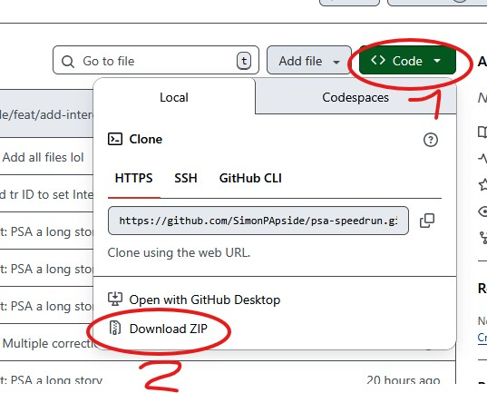
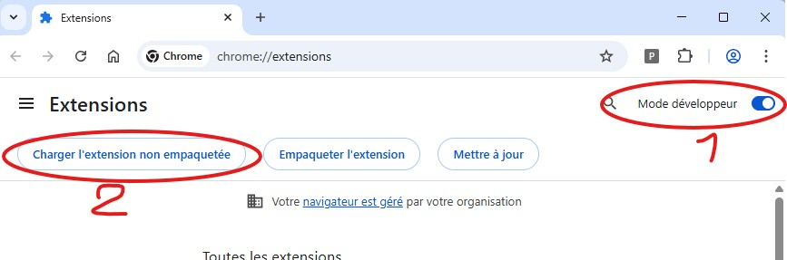

# PSA Speedrun

Extension Chrome qui remplit automatiquement vos feuilles de temps PSA en quelques clics, à partir de votre profil (heures par jour, pause déjeuner, code projet, planning de la semaine).

## Installation & Activation (Chrome) [FR]

Pour activer cette extension dans Google Chrome, suivez les étapes suivantes :

1. **Télécharger le code** : Récupérez les fichiers du projet (par exemple via "Download ZIP").
   
2. **Ouvrir les Extensions** : Dans Chrome, allez dans le menu, puis **Extensions** > **Gérer les extensions**, ou tapez `chrome://extensions/` dans la barre d'adresse.
3. **Activer le Mode Développeur** : En haut à droite, activez l'interrupteur **Mode développeur**.
4. **Charger l'extension** : Cliquez sur **Charger l'extension non empaquetée** et sélectionnez le dossier du projet décompressé.
   

## Versions

- [Changelog](CHANGELOG.md)
- [Releases](https://github.com/SimonPApside/psa-speedrun/releases)